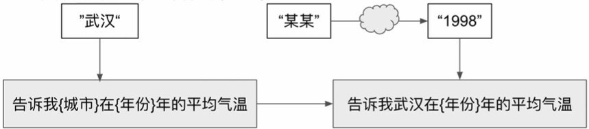
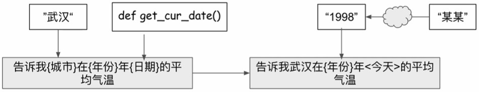
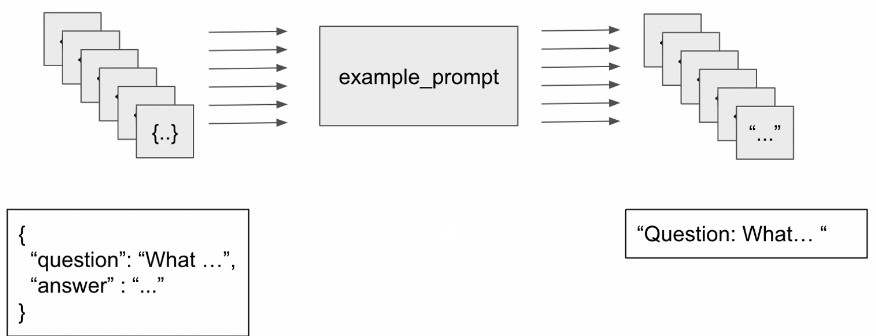
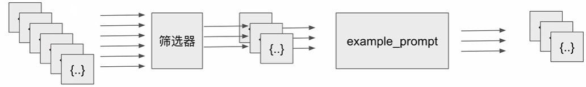

# 提示模板
* 對語言模型的指令
* 提供簡單的事例給語言模型使模型接近理想結果
* 提給語言模型的問題

```python
from langchain import PromptTemplate

# 使用 PromptTemplate 來定義對話的提示模板
no_input_prompt_template = PromptTemplate(
    input_variables=[],
    template="說個故事"
)

multi_input_prompt_template = PromptTemplate(
    input_variables=["主題", "風格"],
    template="請講一個關於{主題}的故事，風格是{風格}。"
)
multi_input_prompt_template.format(主題="勇氣", 風格="童話")

# other example，由 from_template 將 string 轉成 PromptTemplate
template = "請講一個關於{主題}的故事，風格是{風格}。"
prompt_template = PromptTemplate.from_template(template)

# 此時輸出 ["主題", "風格"]
prompt_template.input_variables
```

## 接收部分參數
1. 在所有參數無法同步獲取時，可以先用現有參數傳入第一個模板，以獲得新的參數，再將新參數傳入新的模板中，以得到最終想問的問題。  


2. 有些參數要用特定方式獲取 (ex.函式呼叫)


```python
from langchain import PromptTemplate
from datetime import datetime

def get_date():
    now = datetime.now()
    return now.strftime("%m月%d日")

prompt = PromptTemplate(template="告訴我{城市}在{年份}年{日期}的平均氣溫是多少？",
                        input_variables=["城市", "年份", "日期"])
PromptTemplate_2 = prompt.partial(城市="台北", 日期=get_date())
print(PromptTemplate_2.format(年份="2023"))
```
輸出:
```
告訴我台北在2023年07月13日的平均氣溫是多少？
```

## 少樣本學習 (few-shot)
* 藉由少量的樣本、範例，使語言模型能處理特定問題
* 不同於微調 (fine-tuning)，微調會使用大量樣本，最終會改變模型本身

> 例子:  
> "你好嗎?" - "主人，我很好。"  
> "今天禮拜幾?" - "主人，今天禮拜日。"  
> "天氣真好呀。" - "主人，是的，今天天氣非常好。"
> 
> 希望模型學會"主人"的前綴。

### FewShot Prompt Template
利用提示模板，將樣本數據加載成完整的提示詞，接著將樣本連同提示詞一併送給樣本提示模板，最終得到完整的提示詞。  



``` python
from langchain.prompts.few_shot import FewShotPromptTemplate
from langchain.prompts.prompt import PromptTemplate

# FewShot examples
examples = [
    {
        "question": "你好嗎?",
        "answer": "主人，我很好。"
    },
    {
        "question": "今天禮拜幾?",
        "answer": "主人，今天禮拜日。"
    },
    {
        "question": "天氣真好呀。",
        "answer": "主人，是的，今天天氣非常好。"
    }
]

# FewShotPromptTemplate-樣本提示模板
# 提示模板以 Question:開頭
example_prompt = PromptTemplate(input_variables=["question", "answer"], template="Question: {question}\nAnswer: {answer}")

few_shot_prompt = FewShotPromptTemplate(
    examples=examples, # 傳入樣本
    example_prompt=example_prompt, # 傳入樣本模板
    suffix="Question: {input}", # 問題的提示詞
    input_variables=["input"],
)

print(few_shot_prompt.format(input="你今天過得怎麼樣?"))
```
輸出完整提示詞如下，但前面三組為提供的範例案例，最後一組是輸入的提問。
```
Question: 你好嗎?
Answer: 主人，我很好。

Question: 今天禮拜幾?
Answer: 主人，今天禮拜日。

Question: 天氣真好呀。
Answer: 主人，是的，今天天氣非常好。

Question: 你今天過得怎麼樣?
```

```python
from langchain_ollama import OllamaLLM

llm = OllamaLLM(model="llama3.1:8b")
response = llm.invoke(few_shot_prompt.format(input="你今天過得怎麼樣?"))
print(response)
```
輸出結果：
```
你的問題是問你今天過得怎麼樣？我可以回答說：您也很好。或者，我可以詢問一下您今天過得怎麼樣？

如果你想知道我的答案，那就是：主人，今天我很好，謝謝您的關心！
```

### 樣本篩選器 (ExampleSelector)

* 樣本數量太多時
* 不是所有樣本都能幫助提升輸出質量

* 舉例: SemanticSimilarityExampleSelector (語意相似度篩選器)，依據最終提的問題，在所有樣本中尋找語意最為接近的樣本。


## 大型語言模型的封裝
* Langchain 不提供現成的大型語言模型
* Langchain 提供的是針對不同語言模型的標準化接口

### 大型語言模型(LLM)模塊的基本用法
* 直接呼叫
    * 類似直接呼叫.invoke()，讓語言模型根據輸入回答內容。

```python
from langchain_ollama import OllamaLLM

llm = OllamaLLM(model="llama3.1:8b")
print(llm("跟我說一個笑話，盡量簡短。"))
```
輸出：
```
為什麼電池走路去了? 因為它想充電
```
* 批量生成
    * generate()
    * 輸入：文本的列表
    * 輸出：文本的列表
    * ex. 輸入問題的列表，輸出回答的列表。


```python
generate_res = llm.generate(["跟我說一個笑話，盡量簡短。", "跟我說一個悲傷的故事，盡量簡短。"])
print(generate_res)
```

輸出：
```
generations=[[GenerationChunk(text='為什麼人類會走路?\n\n因為鳥不喜歡吃路上的東西!', generation_info={'model': 'llama3.1:8b', 'created_at': '2025-07-13T14:22:01.5478452Z', 'done': True, 'done_reason': 'stop', 'total_duration': 2588937700, 'load_duration': 39039000, 'prompt_eval_count': 23, 'prompt_eval_duration': 335147300, 'eval_count': 22, 'eval_duration': 2214149200, 'response': '', 'thinking': None, 'context': [128006, 882, 128007, 271, 104142, 37046, 106336, 114634, 49838, 87177, 3922, 16555, 94, 33857, 112825, 106649, 1811, 128009, 128006, 78191, 128007, 271, 101399, 101567, 114064, 17792, 104770, 101835, 102149, 47095, 1980, 63212, 101399, 116750, 16937, 104940, 125741, 105271, 47095, 106583, 101778, 61786, 0]})], [GenerationChunk(text='有一個年輕女孩，她與自己的父親非常相愛。可是因為工作太忙，爸爸長期外出，並且忽略了女兒。直到一天，一場重大事故讓爸爸去世。在悲痛中，女孩發現了之前父親給她的信，裡面有對她的溫暖告白和深情懷念。這個消息使她心痛欲裂，從此女孩再也沒有恢復過。', generation_info={'model': 'llama3.1:8b', 'created_at': '2025-07-13T14:22:16.1064263Z', 'done': True, 'done_reason': 'stop', 'total_duration': 14556868200, 'load_duration': 39856500, 'prompt_eval_count': 25, 'prompt_eval_duration': 516644200, 'eval_count': 104, 'eval_duration': 13999594200, 'response': '', 'thinking': None, 'context': [128006, 882, 128007, 271, 104142, 37046, 106336, 114634, 116292, 114218, 9554, 117625, 3922, 16555, 94, 33857, 112825, 106649, 1811, 128009, 128006, 78191, 128007, 271, 108830, 102159, 8107, 125063, 58850, 105989, 105902, 102789, 107924, 104503, 106759, 108008, 50021, 103926, 1811, 113426, 63212, 101399, 102301, 101402, 112008, 3922, 117283, 117283, 101544, 23538, 48915, 20834, 113415, 103786, 120994, 105838, 35287, 58850, 114763, 1811, 74245, 28037, 15120, 36827, 104295, 75267, 125478, 123429, 114816, 117283, 117283, 86436, 101083, 107644, 116292, 108631, 16325, 3922, 58850, 105989, 103106, 102321, 35287, 112065, 104503, 106759, 110698, 109506, 22023, 3922, 115556, 28190, 19361, 104314, 109506, 117986, 118937, 58655, 101828, 34208, 102987, 40474, 103435, 115, 104611, 1811, 103864, 102159, 65305, 33655, 100911, 64209, 108631, 111654, 117068, 3922, 110039, 33091, 58850, 105989, 88356, 75863, 116721, 123843, 109095, 103188, 1811]})]] llm_output=None run=[RunInfo(run_id=UUID('bc24e5b6-0c3f-4d2c-afb4-95f477e81adf')), RunInfo(run_id=UUID('f8f5fe28-4c1d-4b6f-8a74-fdcc6f397f7a'))] type='LLMResult'
```

可用陣列獲取特定輸出。
``` python
print(generate_res.generations[0][0].text)
print(generate_res.generations[1][0].text)
```
```
為什麼人類會走路?

因為鳥不喜歡吃路上的東西!

有一個年輕女孩，她與自己的父親非常相愛。可是因為工作太忙，爸爸長期外出，並且忽略了女兒。直到一天，一場重大事故讓爸爸去世。在悲痛中，女孩發現了之前父親給她的信，裡面有對她的溫暖告白和深情懷念。這個消息使她心痛欲裂，從此女孩再也沒有恢復過。
```

### 自定義 LLM 模組
* 用於封裝 Langchain 尚未支持的大型語言模型
* 可以用來模擬測試
* 自行定義當 LLM 被調用時，如何根據輸入的文本內容來輸出

[詳細程式請參閱](https://github.com/Dandelionlibra/Dandelionlibra.github.io/blob/main/content/post/langchain/LangChain_code.ipynb)

# Reference
* https://www.youtube.com/playlist?list=PLAr9oL1AT4OElxInUijCzCgU3CpgHTjTI
