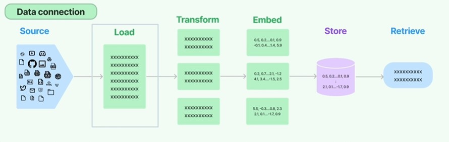
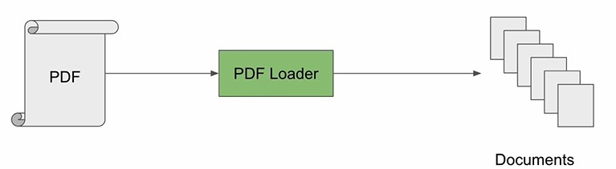
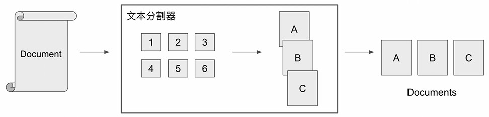

# Data Connection
## 定義  
許多基於大型語言模型而執行的應用常會用到模型數據集中沒有的數據。而針對這類需求，Langchain 提供了許多工具使用戶可以從各類數據源中加載新的數據、轉換數據、儲存數據、訪問數據。

※大型語言模型不可能在訓練階段就涵蓋所有數據，且每時每刻都有新的數據產生。

* 文檔載入器(Document loaders): 從多種數據源加載文檔，ex.網頁、pdf。
* 文檔轉換器: 拆分文檔、丟棄冗餘文檔，主要運行在文檔載入器之後，針對加載出來的文檔做處理。
* 文本嵌入(embedding)模型: 將非結構化的文本轉為浮點數列表。
* 向量數據庫: 儲存和搜尋 embedding 數據。
* 檢索器: 查詢向量數據。

## Data Connection 處理流程  


### 1. 文本載入器(Document loaders)

將文本數據從原始數據(Source)中提取出來，改成 langchain 認識的語言，總而言之就是將非結構化的文本數據加載到結構化的字符串中。  
* 輸入: 各種數據源，ex.PDF、URL、影片。
* 輸出: 一系列的 Document 對象，例，有6頁pdf會產出6個 documents，以分別對應。
      
* 舉例  
    * 結構化文件: 加載 CSV 文件
        ```python
        from langchain.document_loaders.csv_loader import CSVLoader

        loader = CSVLoader(file_path='./data/file.csv')
        data = loader.load()
        ```

    * 非結構化文件: 純文本、ppt、html、pdf、圖片。  

    [全部文件格式](https://python.langchain.com/docs/integrations/document_loaders/)

### 2. 文本分割器(Document transformers)

將加載好的文檔進行轉換，從而更好的適應各種場景。舉例，將文檔拆分成較小的塊，以避免大型語言模型對於輸入長度的限制。  
Langchain 中提供的文檔轉換器可以提供拆分、合併、過濾等功能。

* 文本分割器-拆分: 分割長文本，根據語意相關性將所有有關聯的文本放在同一個分割段中。  

1. 將文本拆分為小、具語意意義的塊。
2. 將小塊組合成大塊，直到達到一定規模。
3. 將達到一定規模的塊作為獨立的文本片段，然後創建新的文本塊，此外，為了維持塊間的連貫性，兩個文本塊之間會有重疊的部分。  
以圖例而言，Document 由一塊變為三塊。

### 3. 文本詞嵌入(Word Embedding)
詞嵌入是將詞語數值化表達的方式，通常會將詞映射到高維的向量中，使電腦藉由高維的數字化表達得以理解自然語言的語意，接近的語意=接近的向量距離。   
    
### 4. 向量數據庫
用於儲存嵌入的數據向量。

### 5. 檢索器
根據輸入的非結構化查詢語句返回對應文檔的接口(一系列 Documents 對象)。  
不同於向量數據庫，向量數據庫可以視為一種具備儲存功能的檢索器，但檢索器不一定需要具備儲存的功能。


## 程式事例  
[詳細程式請參閱](https://github.com/Dandelionlibra/Dandelionlibra.github.io/blob/main/content/post/langchain/LangChain_csv_loader.ipynb)

# Reference
* https://www.youtube.com/playlist?list=PLAr9oL1AT4OElxInUijCzCgU3CpgHTjTI
