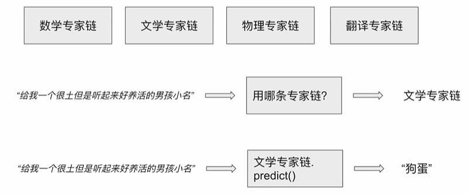
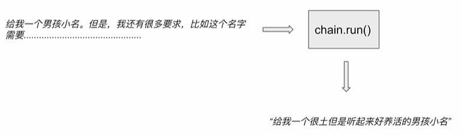
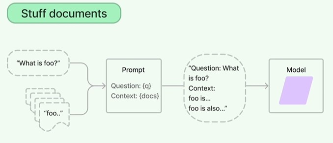
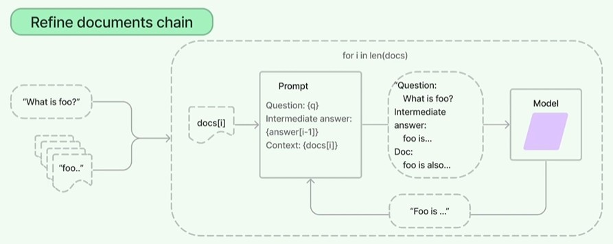

# 甚麼是 Langchain 的鏈結構?
## 定義  
將小的模組串起來，而形成的串列結構。  
舉例: 定義提示詞 -> 選擇 LLM -> 運行 inferencing(呼叫 function) -> 得到結果。

* 優點:
    * 模組化更容易修改個別功能，而不影響其他部分
    * 提高了模組的標準化、可再用性

# 鏈結構分類  
* 基礎鏈結構
    * LLM chain (單鏈)  
        對應直接調用大型語言模型，最少 1 次 LLM call。  
        ex. llm.invoke()  
        1. 定義 prompt
        2. 定義 llm
        3. 定義 chain
        4. 運行 predict

    * Router chain (多鏈)  
        判斷要使用哪個鏈，最少 2 次 LLM call，第一次呼叫是為了決定使用哪條鏈，第二次是為了得到回答。  
        1. 定義 prompt
        2. 定義 llm/emdeddings
        3. 定義 chain (多鏈併行，選一條鏈處理)
        4. 運行 predict
    

    * Sequential chain (多鏈)  
        上一個語言模型的調用結果是下一個語言模型調用的輸入。
        1. 定義 prompt
        2. 定義 llm/emdeddings
        3. 定義 chain (多鏈併行，依照順序執行)
        4. 運行 predict

    * Transformation chain (文本處理鏈)  
        將輸入文本處理後。
        

* 應用鏈結構
    * Document chains type (長文本處理鏈): 總結、向量數據庫
        * Stuff: 
            當要詢問模型沒有訓練過的訊息時，要透過 prompt 將資訊傳入，但若輸入長度超過模型可接受的最大 token 會無法運行。
            
        * Refine: 
            調用多次語言模型，將原本的長上下文分段落，避免輸入超過最大 token 的問題，將上一輪的輸出作為中間回答放到第三部分中
            
        * Map reduce
        * Map rerank

    * Retrieval QA

## 程式事例  
[詳細程式請參閱](https://github.com/Dandelionlibra/Dandelionlibra.github.io/blob/main/content/post/langchain/LangChain_link.ipynb)

# Reference
* https://www.youtube.com/playlist?list=PLAr9oL1AT4OElxInUijCzCgU3CpgHTjTI
