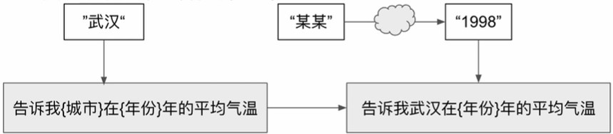

# 提示模板
* 對語言模型的指令
* 提供簡單的事例給語言模型使模型接近理想結果
* 提給語言模型的問題

```python
from langchain import PromptTemplate

# 使用 PromptTemplate 來定義對話的提示模板
no_input_prompt_template = PromptTemplate(
    input_variables=[],
    template="說個故事"
)

multi_input_prompt_template = PromptTemplate(
    input_variables=["主題", "風格"],
    template="請講一個關於{主題}的故事，風格是{風格}。"
)

# other example，由 from_template 將 string 轉成 PromptTemplate
template = "請講一個關於{主題}的故事，風格是{風格}。"
prompt_template = PromptTemplate.from_template(template)

# 此時輸出 ["主題", "風格"]
prompt_template.input_variables
```

## 接收部分參數
在所有參數無法同步獲取時，可以先用舊有參數傳入原始模板，以獲得新的模板，再將由其他語言模型中取的的新參數傳入新的模板中。


## 


# Reference
* https://www.youtube.com/playlist?list=PLAr9oL1AT4OElxInUijCzCgU3CpgHTjTI
