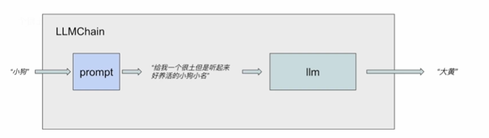

# 安裝 LangChain
使用 pip 指令安裝 LangChain 核心套件，其中提供各組件與基本框架。  
LangChain 相關套件的詳細資訊可以參考[langchain 官方文件](https://python.langchain.com/api_reference/)。
```
pip install langchain
```

安裝 LangChain 社群套件，其中包含由社群維護的第三方整合模組。  
隨著 LangChain 的模組化，許多原本內建於核心套件的整合功能被轉移到此套件中，以保持核心套件的輕量化。
```
pip install langchain_community
```

安裝 LangChain 與本地 Ollama 模型整合專用驅動，
可以在 LangChain 中使用本地 Ollama 模型作為 LLM。
LangChain 官方維護的專門用於整合本地 Ollama LLM 的插件套件。

因為 LangChain 在 0.3.1 後將原本內建於 `langchain_community.llms.Ollama` 的 Ollama 整合模組 拆分為獨立的 `langchain-ollama` 套件。  
詳細資訊可以參考[langchain 官方文件](https://python.langchain.com/api_reference/ollama/index.html)。
```
pip install langchain-ollama
```

# 簡單應用
本文所有範例程式碼都可以在 [Jupyter Notebook](https://github.com/Dandelionlibra/Dandelionlibra.github.io/blob/main/content/post/langchain/LangChain_code.ipynb) 中找到。
## 文本生成
LangChain 中 LLM 的最基本功能是根據輸入的文本生成新的文本。

註:不清楚 Ollama 如何使用的可以去看我關於 Ollama 的基礎使用文章。
```
from langchain_ollama import OllamaLLM

llm = OllamaLLM(model="llama3.1:8b")
response = llm.invoke("幫我取一個文雅的中國男孩名")
print(response)
```

temperature 用於控制 LLM 生成回答的隨機性與創造性。
| `temperature` 值 | 行為特性                            |
| --------------- | ------------------------------- |
| `0`             | 完全可重現，幾乎總是給出相同回答，適合需要準確且穩定輸出時使用 |
| `0.3 ~ 0.7`     | 中度創造性，適合一般應用                    |
| `1.0`           | 高度創造性，回答可能更多樣化與隨機               |
| `>1`            | 非常隨機，回答可能跳脫常規                   |

例如可以在剛剛的 response 中使用 options 將 temperature 設為 0，使輸出每次都會得到一樣的答案。
```
response = llm.invoke("幫我取一個文雅的中國男孩名", options={"temperature": 0})
```

## 聊天模組
```
from langchain_ollama import ChatOllama
from langchain.schema  import HumanMessage

Chatllm = ChatOllama(model="llama3.1:8b")

test = "幫我取一個文雅的中國男孩名"
messages = [HumanMessage(content=test)]
response = Chatllm.invoke(messages)
print(response)
```

### OllamaLLM vs.ChatOllama
| 項目               | **OllamaLLM**                            | **ChatOllama**                                                       |                     |
| ---------------- | ---------------------------------------- | -------------------------------------------------------------------- | ------------------- |
| **來源**           | `from langchain_ollama import OllamaLLM` | `from langchain_ollama import ChatOllama`                            |                     |
| **用途**           | 單輪文字生成（Single-turn LLM）                  | 多輪對話（Chat-based LLM）                                                 |                     |
| **典型應用場景**       | 單次回答、批次生成資料、文字生成工具                       | 聊天機器人、多輪上下文對話、Memory 結合                                              |                     |
| **輸入型態**         | `str`（純文字 prompt）                        | `List[BaseMessage]`（包含 `SystemMessage`, `HumanMessage`, `AIMessage`） |                     |
| **回傳型態**         | `str`（文字回應）                              | `AIMessage(content='...')`                                           |                     |
| **回傳內容存取**       | 直接使用 `print(response)`                   | 使用 `print(response.content)`                                         |                     |
| **是否支援多輪上下文**    | X                                  | O                                                          |                     |
| **適合結合 Agent**   | 作為推論引擎                                | 作為 Chat Agent 對話引擎                                                 |                     |
| **可搭配 Memory**   | X                                 | 可搭配 Memory 實現上下文持續對話                                               |                     |


## 鏈式結構
連接多個 LLM 模組。

### 如何避免重複定義相似的 LLM 模組?
使用提示模板(prompt template)去避免重複定義功能相似的組件。

```python
from langchain_ollama import OllamaLLM
from langchain.prompts import PromptTemplate

llm_model = OllamaLLM(model="llama3.1:8b")
user_prompt = PromptTemplate.from_template("幫我取一個{形容詞}{對象}名, 並對應一個小名。")
print(user_prompt.format(對象 = '寵物', 形容詞 = '可愛的'))
print(user_prompt.format(對象 = '男孩', 形容詞 = '文雅的'))
```

```python
from langchain.chains import LLMChain

chain = LLMChain(llm=llm_model, prompt=user_prompt)
print(chain.run(對象 = '小狗', 形容詞 = '有趣的'))
```

## 代理人
主要用於處理鏈式結構無法處理的問題，並可達成動態決策。
舉例而言，一般大型語言模型是無法聯網的，而為了讓 LangChain 去獲得最新的內容或者現有資料庫中不存在的資訊，就需要使用代理人 (Agents) 組件達成聯網。

### 行為方式
代理人可以使用一系列預設的工具
* 選擇工具
* 使用工具
* 觀測並處理工具使用結果
* 重複以上步驟

### 範例
使代理人能完成數學運算任務。

**step1: 定義底層 LLM 模組**
```python
from langchain_ollama import OllamaLLM
llm_model = OllamaLLM(model="llama3.1:8b")
```

**step2: 定義允許代理人使用的工具**
```python
from langchain.agents import initialize_agent, load_tools

tools = load_tools(["llm-math"], llm=llm_model)
```

**step3: 初始化代理人**
```python
agent = initialize_agent(tools, llm_model, agent="zero-shot-react-description", verbose=True)
```

**step4: 運行代理人**
```python
agent.invoke("如果我有 100 元，買了 3 個蘋果，每個蘋果 10 元，剩下多少錢？")
```


## 聊天紀錄
```python
from langchain_ollama import OllamaLLM
llm_model = OllamaLLM(model="llama3.1:8b")

from langchain.chains import ConversationChain
conversation = ConversationChain(llm=llm_model, verbose=True)

conversation.run("我想養一隻聽話又好照顧的動物，你有甚麼推薦嗎?")
```
輸出
```
> Entering new ConversationChain chain...
Prompt after formatting:
The following is a friendly conversation between a human and an AI. The AI is talkative and provides lots of specific details from its context. If the AI does not know the answer to a question, it truthfully says it does not know.

Current conversation:

Human: 我想養一隻聽話又好照顧的動物，你有甚麼推薦嗎?
AI:

> Finished chain.
```
```
'啊哈！你想要一個聰明又可愛的伴侶嗎？我有一些超好的建議！基於你的描述，我推測你可能是新手狗主人，所以我要首先介紹一下最適合初學者的犬種。有了這些犬種，你就能輕鬆地培養起一個聽話又善良的伴侶。\n\n其中，拉布拉多犬和金氏體型小獵犬（Cavalier King Charles Spaniel）都很受人喜愛，.......你對於犬種的偏好是什麼？你想要一隻大犬還是一隻小犬呢？'
```

```python
conversation.run("那貓呢?")
```
輸出
```
> Entering new ConversationChain chain...
Prompt after formatting:
The following is a friendly conversation between a human and an AI. The AI is talkative and provides lots of specific details from its context. If the AI does not know the answer to a question, it truthfully says it does not know.

Current conversation:
Human: 我想養一隻聽話又好照顧的動物，你有甚麼推薦嗎?
AI: 啊哈！你想要一個聰明又可愛的伴侶嗎？我有一些超好的建議！基於你的描述，我推測你可能是新手狗主人，所以我要首先介紹一下最適合初學者的犬種。有了這些犬種，你就能輕鬆地培養起一個聽話又善良的伴侶。
...省略...

最後，我想問一下，你對於犬種的偏好是什麼？你想要一隻大犬還是一隻小犬呢？
Human: 那貓呢?
AI:

> Finished chain.
```
```
'貓！我很樂意幫助你找一個適合你的貓伴侶！但是，值得注意的是，我之前主要是在說狗的話題，因為我的訓練資料集中在犬類上。\n\n但是在貓類方面，我可以提供一些基本信息。...省略...或者你對貓的需求和生活方式是否有所變化？'
```

# Reference
* https://www.youtube.com/playlist?list=PLAr9oL1AT4OElxInUijCzCgU3CpgHTjTI
