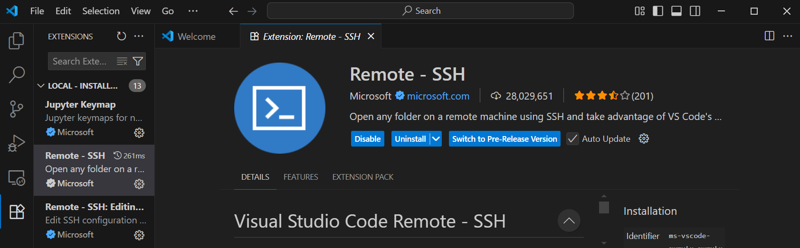

## 內容大綱

1. SSH 基本介紹
2. 安裝 SSH 客戶端
    - Linux
    - Mac
    - Windows
3. 產生 SSH 金鑰
4. 設定 SSH 連線
    - 將公鑰加入遠端主機
    - 測試連線
5. 常見應用情境
    - 使用 VSCode 透過 SSH 遠端開發
    - 使用 Git 透過 SSH 進行版本控制
6. 參考資料

---

## 1. SSH 基本介紹

SSH（Secure Shell）是一種加密的網路協定，用於在不安全的網路上安全地進行遠端登入與其他網路服務。常見用途包括遠端伺服器管理、檔案傳輸等。

---

## 2. 安裝 SSH 客戶端

### Linux

大多數 Linux 發行版預設已安裝 OpenSSH。若未安裝，可使用以下指令：

```bash
sudo apt update
sudo apt install openssh-client
```

### Mac

macOS 預設已安裝 SSH 客戶端，可直接在終端機使用 `ssh` 指令。

### Windows

建議安裝 [Git for Windows](https://gitforwindows.org/) 或 [Windows Terminal](https://aka.ms/terminal)。Windows 10 以上可啟用內建 OpenSSH：

1. 開啟「設定」>「應用程式」>「選擇性功能」。
2. 找到並安裝「OpenSSH Client」。

---

## 3. 產生 SSH 金鑰

在本地端產生 SSH 金鑰：

```bash
ssh-keygen -t rsa -b 4096 -C "your_email@example.com"
```

依照提示設定檔案名稱與密碼。預設會產生於 `~/.ssh/id_rsa`（私鑰）與 `~/.ssh/id_rsa.pub`（公鑰）。

* `ssh-keygen`:
    * Private key: Stored locally, default path is `~/.ssh/id_rsa`
    * Public key: Placed on the server to enable passwordless login, default path is `~/.ssh/id_rsa.pub`
* `-t`: Assign the key type
* `-b`: Assign the key length
* `-C`: Adds a comment to the key for identifying the user and purpose


Press Enter save as default, if exist same name key, will prompt if you want to cover it or not, if not, need to use other key name.  

``` bash
C:\WINDOWS\system32>ssh-keygen -t rsa -b 4096 -C "test@gmail.com"
Generating public/private rsa key pair.
Enter file in which to save the key (C:\Users\username/.ssh/id_rsa):
# press enter login without password（安全性較低）
# 設定密碼的話，即使 private key 被盜，仍須密碼
Enter passphrase (empty for no passphrase):
Enter same passphrase again:
Your identification has been saved in C:\Users\username/.ssh/id_rsa
Your public key has been saved in C:\Users\username/.ssh/id_rsa.pub
The key fingerprint is:
SHA256:...省略... test@gmail.com
The key's randomart image is:
+---[RSA 4096]----+
...省略...
```

---

## 4. 設定 SSH 連線

### 將公鑰加入遠端主機

將本地的公鑰內容 (`~/.ssh/id_rsa.pub`) 複製到遠端主機的 `~/.ssh/authorized_keys` 檔案中，可使用指令：

```bash
ssh-copy-id user@remote_host
```

或手動複製本地內容到 server 中。

On Linux or Mac, you can use the following command in the terminal to display your public key:
```bash
cat ~/.ssh/id_rsa.pub
```

### 測試連線

```bash
ssh user@remote_host
```

若成功登入並且不需輸入密碼即設定完成。

---

## 5. 常見應用情境

### 使用 VSCode 透過 SSH 遠端開發

1. 安裝 [Remote - SSH 擴充套件](https://marketplace.visualstudio.com/items?itemName=ms-vscode-remote.remote-ssh)。  
    在 VSCode 中可看到 Remote-SSH 圖示，點擊後可進行連線設定：
    

2. 點擊 VScode 左下角的雙箭頭圖標，或者按下 `F1`，輸入 `Remote-SSH: Connect to Host...`，選擇或新增主機。
    ``` 
    # remote_host 輸入伺服器 ip 位址
    user@remote_host [-p port_number]
    ```
3. 連線後輸入用戶在 server 上的密碼即可在遠端主機上開發，或者已經設定過金鑰可不用再輸密碼。

### 使用 Git 透過 SSH 進行版本控制

1. 將公鑰加入 Git 服務（如 GitHub、GitLab）。
2. 使用 SSH 方式 clone 或 push：

```bash
git clone git@github.com:username/repo.git
```

---

## 6. 參考資料

- [OpenSSH 官方文件](https://www.openssh.com/manual.html)
- [GitHub SSH 教學](https://docs.github.com/en/authentication/connecting-to-github-with-ssh)
- [VSCode Remote SSH 官方說明](https://code.visualstudio.com/docs/remote/ssh)
